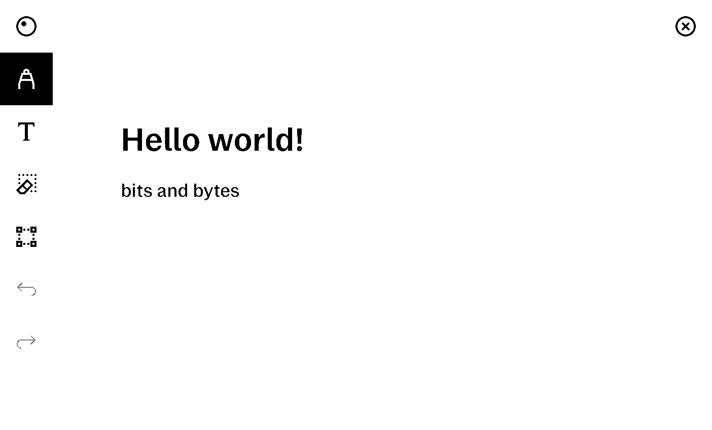

# kar*M*tka

generate simple pages in reMarkable lines format and inject them 
into existing notebooks.  

Serializer for the reMarkable binary format was created through [reMarkable kaitai specification](https://github.com/cyanjnpr/reMarkable-kaitai-v6).

## Usage

This tool is intended to be used on device to allow external apps 
such as KOReader to copy/paste parts of opened documents into rM notebooks.

It is also possible to run it outside of reMarkable and save generated page to a .rm file.

Example usage:
```
cat /etc/os-release | karmtka -g tux.png -q 15 -s 4 -x -i current --overwrite
```
Above line will inject image from the file tux.png and piped output of the cat command 
into the current reMarkable notebook page.



There is a risk of damaging existing notebooks while using this tool.

## Options
- `-t, --text` text content of the reMarkable page
- `-s, --style` text style of the content
- `-w, --weight` font weight of the content
- `-u, --uuid` UUID of the page
- `-m, --margin` margin of the text content
- `-d, --device` target device for the generated page, default is 'rm'
- `-O` save the page to a local file named after the uuid
- `-o, --output` save the page to a local file
- `-x, --xochitl` run in reMarkable mode (on the device)
  - this mode will inject generated page into an existing notebook
- `-i, --inject` inject mode for the xochitl option, default is 'append'
  - append - inject new page into last closed notebook
  - current - inject new (overwrite) content into last closed page
  - next - inject new (overwrite) content into page next to the 'current' one
  - last - inject new (overwrite) content into last page in last closed notebook
- `--overwrite` confirm overwrite operation if such mode is selected
- `-g, --image` path to the image file to be injected into the page
- `-q, --quality` quality of the injected images, default is '3'
  - using values higher than the default may result in a huge file size
- `--dry` dry run, prints which notebook and page would be modified on a normal run, must be used with `-x`
- `-n, --notebook` set alternative notebook as injection target instead of the most recent one.
  - This has to be a full path to the notebook, for example: Notebook named 'notes' in directory 'projects' should be specified as 'projects/notes'
- `-l, --list` do not generate anything, list all available notebooks, must be used with `-x`
- `-v, --version` print version of this tool

## Building

> [!Note]
> This project is based on python version 3.9.
>
> Python was chosen, because of kaitai limitations when it comes to serialization.
>
> Soon to be deprecated version 3.9 was chosen to 
> make sure this project works on older reMarkable software versions.
> For more information check [Nuitka documentation](https://nuitka.net/user-documentation/common-issue-solutions.html#linux-standalone).

Compilation to standalone binary is possible thanks to Nuitka python compiler.

> [!Warning]
> Nuitka does not support cross-compilation
> at the moment of writing.
> It is necessary to emulate the target architecture during compilation.

To emulate target architecture with docker you will need to install QEMU and binary format rules for QEMU emulation.


Docker compose file `compose.yaml` contains service definitions for building binaries for reMarkable 1, 2 and reMarkable Paper Pro.
To compile repo to binary standalone for your device run `docker compose` with matching *--profile* option:
```bash
# compile for reMarkable 1 & 2
docker compose --profile rm up

# compile for reMarkable Paper Pro
docker compose --profile rmpp up
```
This process may take a while.


This repository is not affiliated with reMarkable AS.


