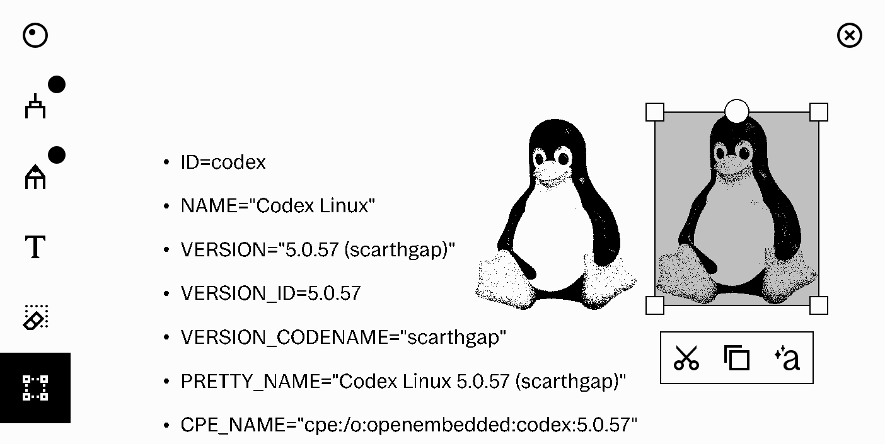

# kar*M*tka

generate simple text pages in reMarkable lines format and inject them 
into existing notebooks. <br/>

Serializer for the reMarkable binary format was created through [reMarkable kaitai specification](https://github.com/cyanjnpr/reMarkable-kaitai-v6).

## Usage

This tool is intended to be used on device to allow external apps 
such as KOReader to copy/paste parts of opened documents into rM notebooks.

It is possible to run it outside of reMarkable and save generated page to a .rm file.
Example usage:
```
karmtka -s 2 -w 2 -t $'Hello world!\n' -s 3 -w 1 -t 'bits and bytes' -O
```
Above line will create text page with header and a single paragraph and save it to a local file.



## Options
- `-t, --text` text content of the reMarkable page
- `-s, --style` text style of the content
- `-w, --weight` font weight of the content
- `-u, --uuid` UUID of the page
- `-m, --margin` margin of the text content
- `-d, --device` target device for the generated page, default is 'rm'
- `-O` save the page to a local file named after the uuid
- `-o, --output` save the page to a local file
- `-x, --xochitl` run in reMarkable mode (on the device)
  - this mode will inject generated page into an existing notebook
- `-i, --inject` inject mode for the xochitl option, default is 'append'
  - append - inject new page into last closed notebook
  - current - inject new (overwrite) content into last closed page
  - next - inject new (overwrite) content into page next to the 'current' one
  - last - inject new (overwrite) content into last page in last closed notebook

### Disclaimer(s)

- Serializer was prepared based solely on files produced by xochitl 3.8.2.
- There is a risk of damaging existing notebooks while using this tool.
- This repository is not affiliated with reMarkable AS.
